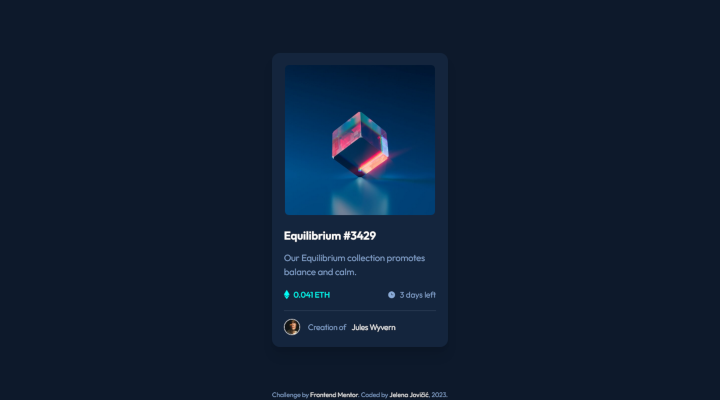

# Frontend Mentor - NFT preview card component solution

This is a solution to the [NFT preview card component challenge on Frontend Mentor](https://www.frontendmentor.io/challenges/nft-preview-card-component-SbdUL_w0U). Frontend Mentor challenges help you improve your coding skills by building realistic projects. 

## Table of contents

- [Overview](#overview)
  - [Description](#description)
  - [Screenshot](#screenshot)
  - [Links](#links)
- [My process](#my-process)
  - [Built with](#built-with)
  - [Observations](#observations)
  - [Useful resources](#useful-resources)
- [Author](#author)

## Overview

### Description

Users should be able to:

- [x] View the optimal layout depending on their device's screen size
- [x] See hover states for interactive elements

### Screenshot

### Links

- [Solution](https://www.frontendmentor.io/solutions/nft-preview-card-component-with-tailwind-css-jtl30qowvG)
- [Live](https://je-jo.github.io/nft-preview-card-component/)

## My process

### Built with

- Semantic HTML5 markup
- Mobile-first workflow
- [Tailwind CSS](https://tailwindcss.com/) - A utility-first CSS framework

### Observations

I used this small project to learn the basics of Tailwind CSS

### Useful resources

- [google web fonts helper](https://gwfh.mranftl.com/fonts) - A Hassle-Free Way to Self-Host Google Fonts.
- [PerfectPixel](https://www.welldonecode.com/perfectpixel/) a Chrome extension for comparing website with design image.

## Author

- [Github](https://github.com/je-jo)
- [LinkedIn](https://www.linkedin.com/in/jelena-jovicic/)
- [Frontend Mentor](https://www.frontendmentor.io/profile/je-jo)
- [Codepen](https://codepen.io/je-jo)
- [Twitter](https://twitter.com/jelena_jo_)
